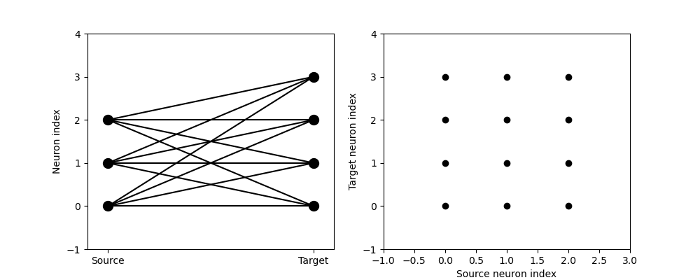
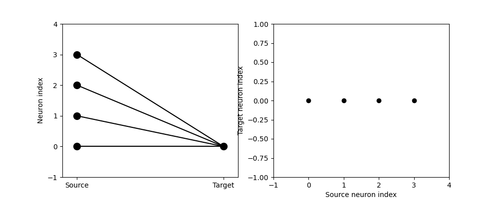
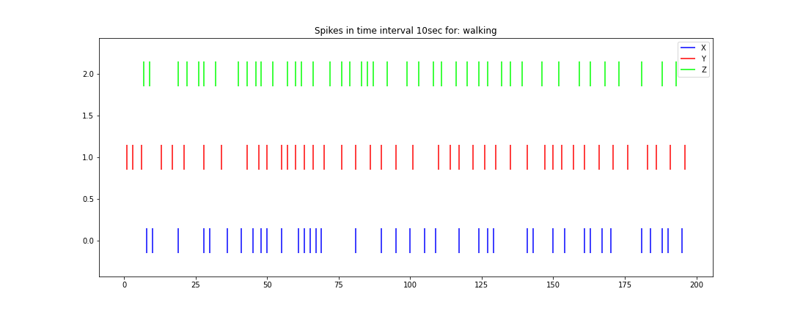
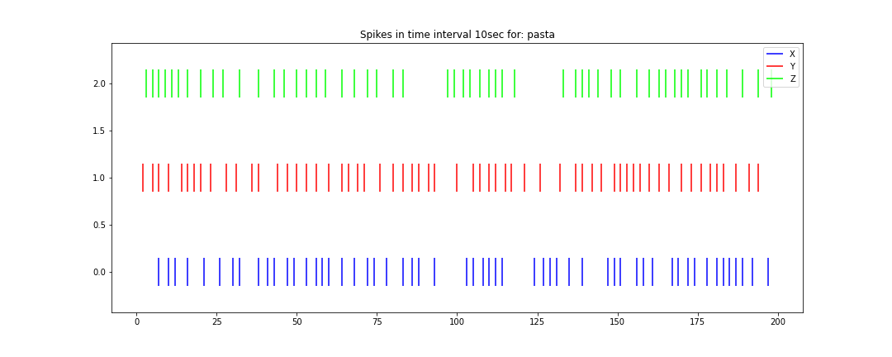
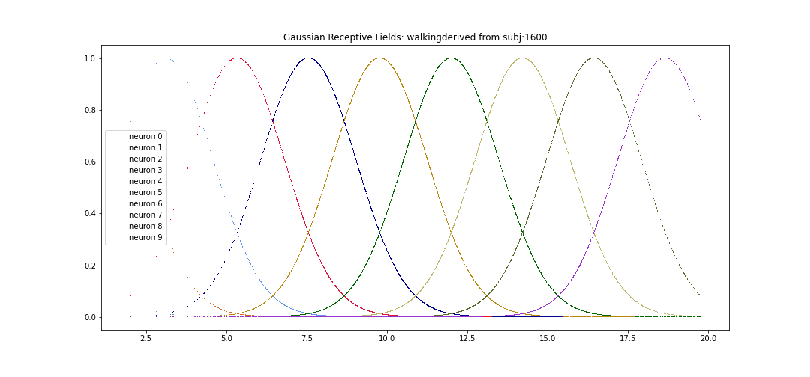
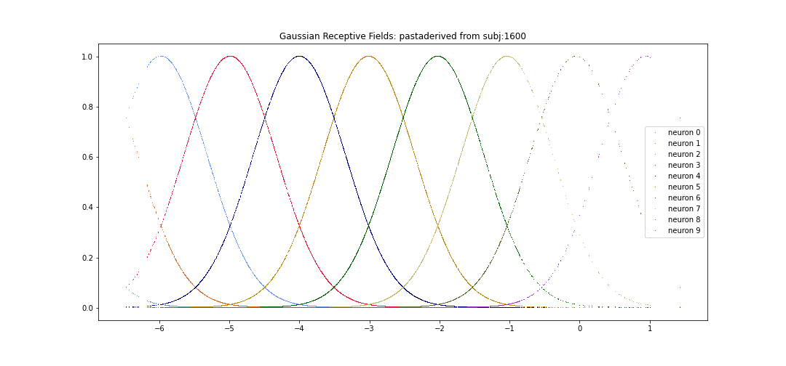
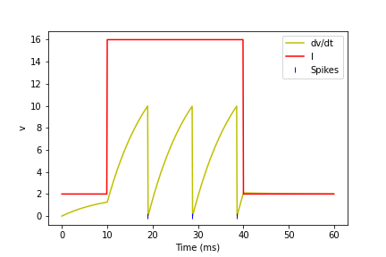

# BRIAN2 

## multilayer SNN

## Sample 2 input neurons and 1 threshold/bias fed into hidden layer with 4 neurons and then one output neuron:

## Output at each layer:
### 0 0 0  input
[0 0 0]
[0 0 0 0]
[0]    output
### 10 10 0 input
[9 9 0]
[8 5 0 7]
[8]    output
### 10 0 0 input
[9 0 0]
[1 1 0 0]
[0]    output
### 0 10 0 input
[0 9 0]
[0 0 1 1]
[0]   output

With much research and trial and error, I finally figured out how to make a multi-layer SNN with Brian2
1. stdp_demo_and_3.py copyright@dsd2020

<figure></figure>
<figure></figure>

## weights from multilayer SNN-just an example-not real sensor data.

<figure></figure>

# Encoding Schemes for WISDM sensor data

## LOCAL OPTIMA
(had my own method. then found scipy method.  cleaner and so scipy)
based on scipy find_peaks
1. wisdm_spikes.py copyright@dsd2020

# Spike trains from sample 10 seconds by LOCAL OPTIMA WALKING 
<figure></figure>

# Spike trains from sample 10 seconds by LOCAL OPTIMA PASTA 
<figure></figure>
 
## GRF - sources
1. Lobo, Jesus L., et al. "Exploiting the stimuli encoding scheme of evolving Spiking Neural Networks for stream learning." Neural Networks 123 (2020): 118-133.
2. Dumoulin, Serge O., and Brian A. Wandell. "Population receptive field estimates in human visual cortex." Neuroimage 39.2 (2008): 647-660.
3. Bohte, Sander M., Joost N. Kok, and Han La Poutre. "Error-backpropagation in temporally encoded networks of spiking neurons." Neurocomputing 48.1-4 (2002): 17-37.
4. Kasabov, Nikola, et al. "Dynamic evolving spiking neural networks for on-line spatio-and spectro-temporal pattern recognition." Neural Networks 41 (2013): 188-201.
5. wisdm_grf.py copyright@dsd2020

# sample 1600 accel watch walking by GRF with 10 neurons
<figure></figure>

# sample 1600 accel watch pasta by GRF with 10 neurons
<figure></figure>

# Benchmark Dataset WISDM Smartphone and Smartwatch Activity and Biometrics Dataset Data Set
Smartphone and Smartwatch-Based Biometrics Using Activities of Daily Living. IEEE Access, 7:133190-133202, Sept. 2019.
1.  Extract watch accelerometer readings and load.  ETL program written in python and pandas.
2.  Plot Input Signals XYZ per 18 activities
3.  Raw readings connected to Simple LIF neuron 
    (not all activities will cause LIF to fire)

## WALKING pattern (LIF spikes)
<figure></figure>

## EATING PASTA pattern (LIF never spikes)
<figure></figure>

# Simplify.  LIF neuron with Brian2 simulation
1. Replicate time series simple array connected to LIF neuron
2. Benchmark Logic Gates

# EXAMPLE
## Simple Timed Array input LIF neuron. Displays input, synaptic output of LIF and Spikes
<figure></figure>

# Investigate Deihl and Cook Algorithm with UCI HAR
Davide Anguita, Alessandro Ghio, Luca Oneto, Xavier Parra and Jorge L. Reyes-Ortiz. A Public Domain Dataset for Human Activity Recognition Using Smartphones. 21th European Symposium on Artificial Neural Networks, Computational Intelligence and Machine Learning, ESANN 2013. Bruges, Belgium 24-26 April 2013.
1. Time series data was transformed for Deep Learning, LSTM
2. Studied Github repository on Deep Learning and this data set
3. Not suitable for time series study and SNN without more information

# Investigate Brian2 and STDP implementation with MNIST data

Diehl, Peter U., and Matthew Cook. "Unsupervised learning of digit recognition using spike-timing-dependent plasticity." Frontiers in computational neuroscience 9 (2015): 99.

1. implement Diehl and Cook Repository
2. Modified Diehl implementation on Python 2 to Python 3
3. Updated to Brian2
4. Testing different encoding schemes for SNN's
5. Reproduced results for SNN and MNIST data

move repository to this folder

# Investigating MIT ECG data and GRF, gaussian receptive fields to encode data

GRF described inLobo, Jesus L., et al. "Evolving spiking neural networks for online learning over drifting data streams." Neural Networks 108 (2018): 1-19.
and Bohte, Sander M., Joost N. Kok, and Han La Poutre. "Error-backpropagation in temporally encoded networks of spiking neurons." Neurocomputing 48.1-4 (2002): 17-37.

Uploaded script wfdb_grf_explore.py

denisesd@email.sc.edu
@2020 dsd
